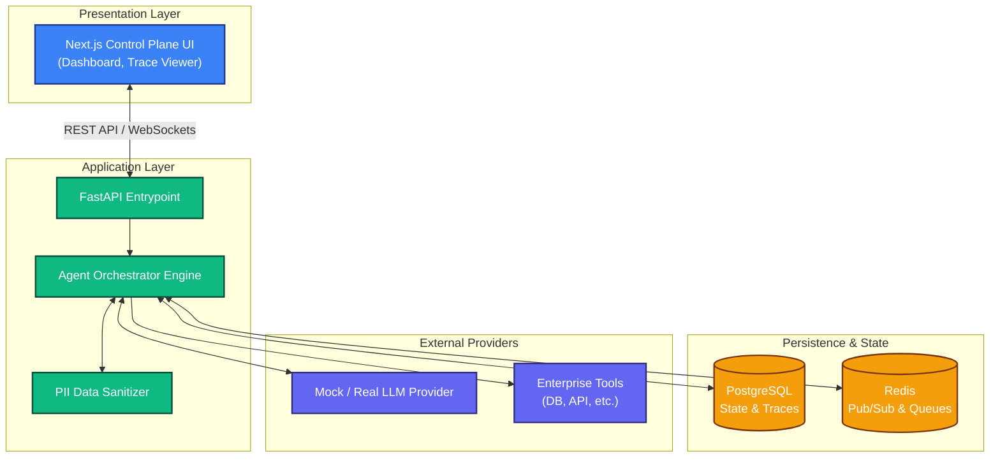
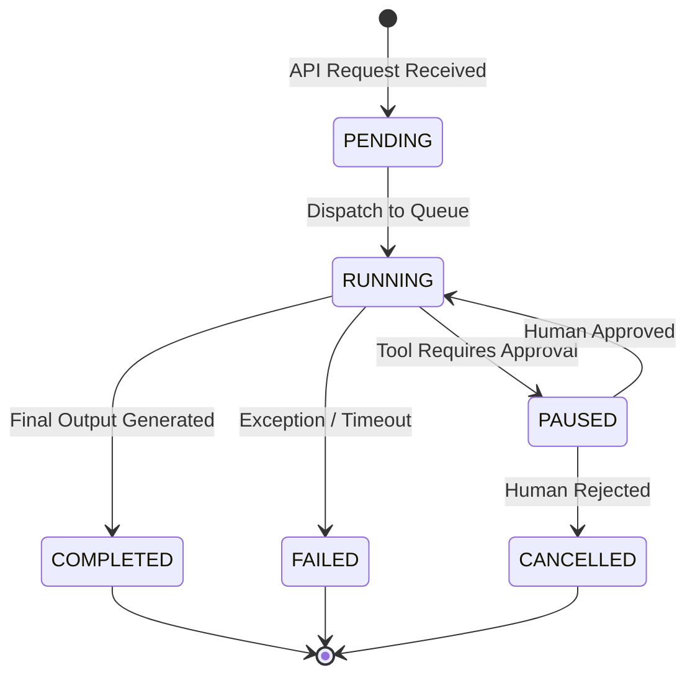

# ORION - Enterprise AgentOps Control Plane

ORION is a specialized observability and governance platform for large-scale AI Agent deployments. It bridges the gap between prototype agentic workflows and production-ready enterprise systems by providing deterministic state management, deep execution tracing, and mandatory human-in-the-loop (HITL) approval gates for sensitive operations.


---

## 🏛️ System Architecture

ORION relies on a decoupled architecture, utilizing a FastAPI orchestration layer backed by PostgreSQL (for state and trace persistence) and Redis (for async task queues). The frontend is a Next.js App Router providing real-time visibility.



## 🔐 Core Features

### 1. Human-in-the-Loop (HITL) Approval Gates
Agents cannot unilaterally execute sensitive actions (e.g., deleting data, refunding money, pushing to production). The Orchestrator automatically pauses workflow execution and enters a `PAUSED` state when a flagged tool is requested. Execution only resumes upon cryptographic or session-based human approval.

### 2. Deep Execution Tracing
Every action an agent takes is recorded in the `ExecutionTrace` table. This includes:
- **Chain of Thought**: The raw reasoning payload from the LLM.
- **Tool Invocation**: Exact JSON inputs provided to the tool.
- **Tool Output**: Raw results returned from the enterprise system.
- **Latency & Tokens**: Exact telemetry for cost and performance analysis.

### 3. PII Masking & Security
The `DataSanitizer` middleware intercepts tool inputs and outputs, using robust regex patterns to redact sensitive information (SSN, Credit Cards, Emails) before it touches the persistence layer.

---

## 🔄 The Agent State Machine

The orchestration engine manages a strict state machine to prevent zombie agents or infinite loops.



## 🛠️ Local Development Guide

ORION is designed to run completely offline without paid API keys (using the built-in deterministic `MockLLMProvider`).

### Prerequisites
- Docker & Docker Compose
- Node.js (v18+)
- Python (3.11+)

### 1. Start Infrastructure
Boot up the PostgreSQL and Redis containers.
```bash
make up
```

### 2. Seed the Database
Populate the system with realistic agent profiles and historical execution traces.
```bash
make seed
```

### 3. Start Backend Services
```bash
cd apps/api
python -m venv venv
source venv/bin/activate
pip install -r requirements.txt
uvicorn main:app --reload --port 8000
```

### 4. Start Frontend Control Plane
```bash
cd apps/web
npm install
npm run dev
```

Navigate to `http://localhost:3000` to access the Control Plane.

---

## 📂 Repository Structure

```text
ORION/
├── apps/
│   ├── api/                  # FastAPI Backend
│   │   ├── core/             # DB & Config
│   │   ├── models/           # SQLModel Schemas
│   │   ├── routers/          # API Endpoints
│   │   └── services/         # Orchestrator, Sanitizer, LLM
│   └── web/                  # Next.js Frontend
│       ├── app/              # Views (Dashboard, Runs, Approvals)
│       ├── components/       # Reusable UI Elements
│       └── lib/              # API Client (Axios)
├── infra/                    # Docker configs
└── scripts/                  # DB Seeding utilities
```

## 🤝 Contributing

This project is a portfolio piece demonstrating Enterprise AgentOps architecture. However, pull requests addressing orchestration deadlocks, enhanced PII regex patterns, or trace streaming implementations are welcome!
