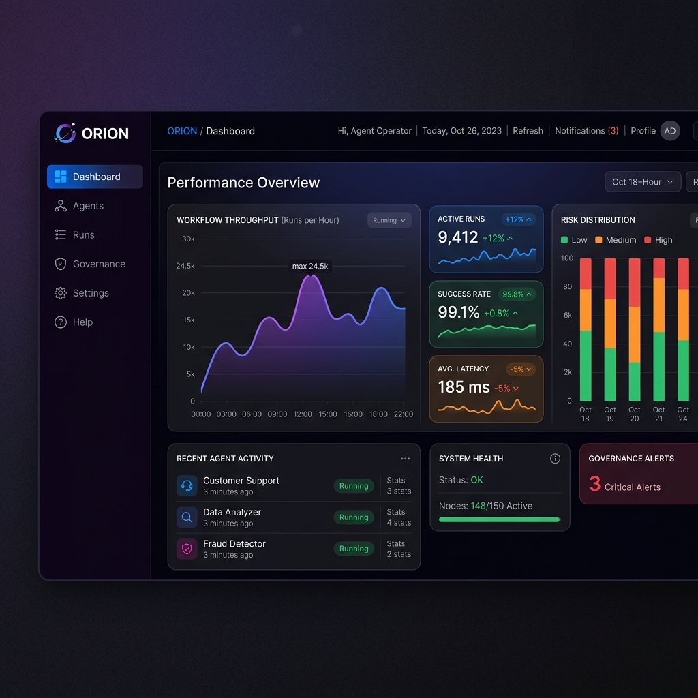
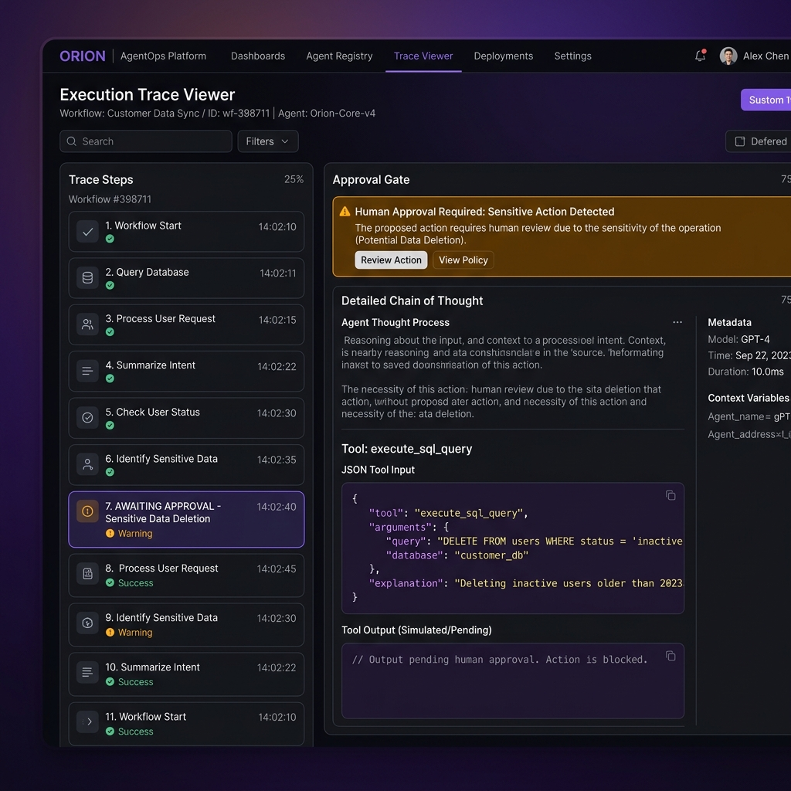
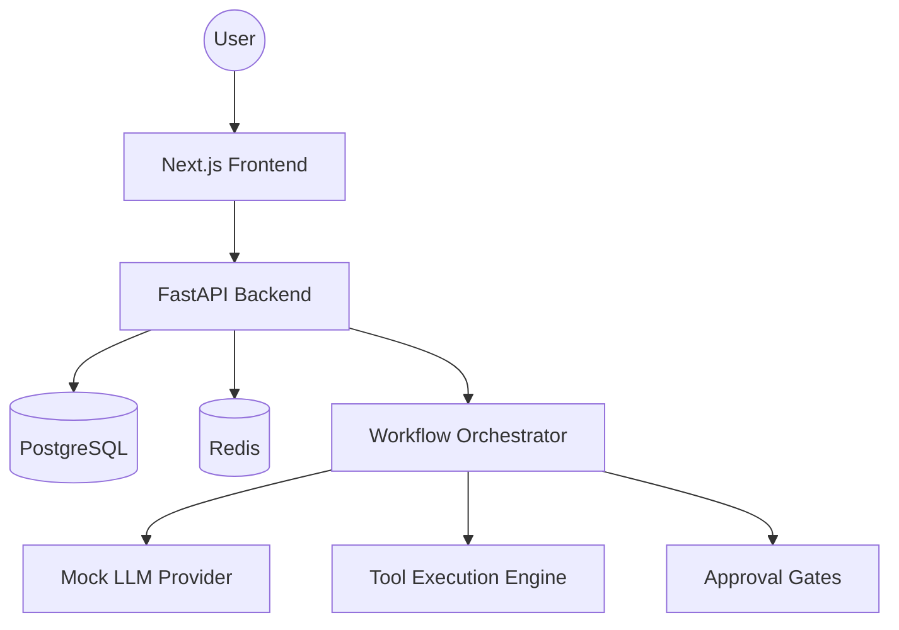

# ORION: Enterprise AI AgentOps Control Plane


**ORION** is a local-first platform for managing, monitoring, and governing AI agents across enterprise workflows. It moves teams from isolated AI assistants to reliable, auditable, and production-grade agent systems.

---

## 🌌 Overview

ORION provides a centralized "Control Plane" for AI operations (AgentOps). It focuses on three core pillars:
1. **Observability**: Deep execution traces, prompt/response logs, and tool call history.
2. **Governance**: Human-in-the-loop approval gates, risk scoring, and permission management.
3. **Reliability**: Deterministic workflow orchestration with structured error handling.


*Real-time observability and risk scoring dashboard.*


*Execution trace viewer with human-in-the-loop approval gate.*

---

## ✨ Feature Grid

| Feature | Description | Status |
| :--- | :--- | :--- |
| **Agent Registry** | Centralized catalog of agents with versioning and role definitions. | ✅ |
| **Trace Viewer** | Inspect every step, thought process, and tool call in real-time. | ✅ |
| **Approval Gates** | Pause sensitive actions (e.g., prod deploys) for human review. | ✅ |
| **Risk Scoring** | Automated signals for privacy, compliance, and tool-usage risks. | ✅ |
| **Tool Registry** | Manage tool permissions and discovery across agent teams. | ✅ |
| **Audit Logs** | Immutable record of all system and agent activities. | ✅ |

---

## 🏗️ Architecture



### Agent Lifecycle
1. **Definition**: Register agent role, system prompt, and allowed tools.
2. **Orchestration**: Trigger workflows via API or UI.
3. **Governance**: Intercept sensitive tool calls via Approval Gates.
4. **Audit**: Permanent storage of execution traces and decisions.

---

## 🚀 Local Setup

### Prerequisites
- Docker & Docker Compose
- Python 3.11+ (optional for local dev)
- Node.js 18+ (optional for local dev)

### Quick Start
```bash
# 1. Clone the repository
git clone https://github.com/your-repo/orion.git
cd orion

# 2. Spin up the platform
make up

# 3. Seed realistic enterprise data
make seed
```

The platform will be available at:
- **Frontend**: [http://localhost:3000](http://localhost:3000)
- **API**: [http://localhost:8000/docs](http://localhost:8000/docs)

---

## 🛠️ Design Decisions

- **Local-First Mocking**: Uses a deterministic mock LLM provider to allow full testing without API costs or key management.
- **Async-First**: The backend uses Python `asyncio` for high-throughput workflow orchestration.
- **Shadcn UI + Framer Motion**: Provides a premium, responsive interface that feels "alive" with micro-animations.
- **SQLModel**: Unifies Pydantic and SQLAlchemy for clean, typed data access.

---

## 🗺️ Roadmap

- [ ] Integration with LangChain and LlamaIndex.
- [ ] Real-time WebSocket streaming for live traces.
- [ ] Multi-tenant organization support.
- [ ] Automated red-teaming for agent responses (ARGUS integration).

---

## 📄 License
Distributed under the MIT License. See `LICENSE` for more information.
